# Monospaced Fonts

### JetBrains Mono
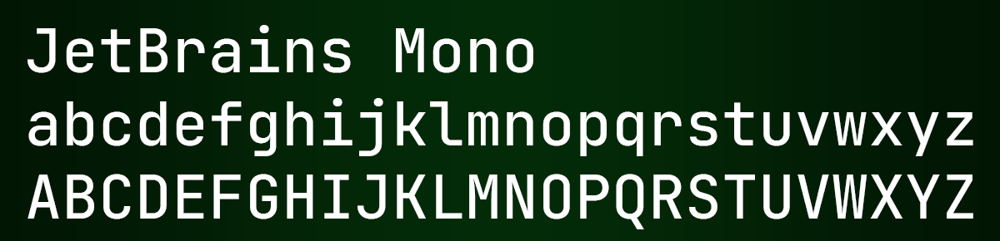

### Operator Mono
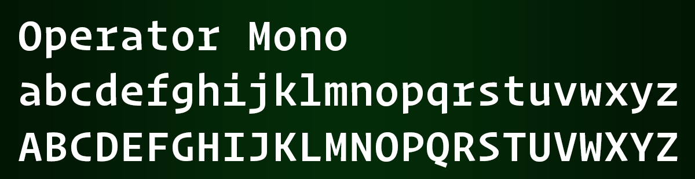

### Cascadia Mono
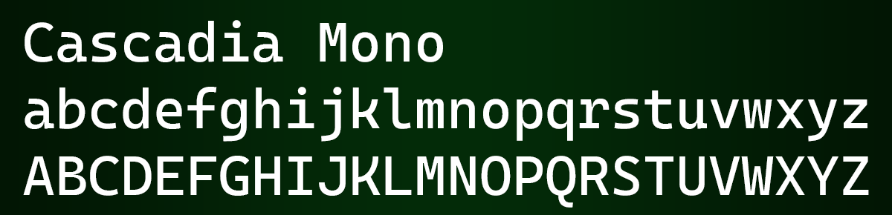

### MonoLisa

### SF Mono
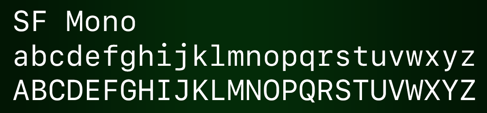

### Fira Code
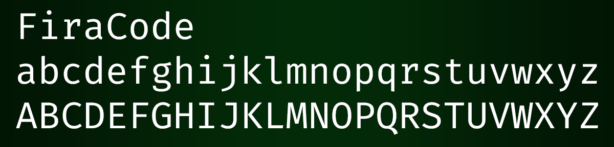

### Victor Mono
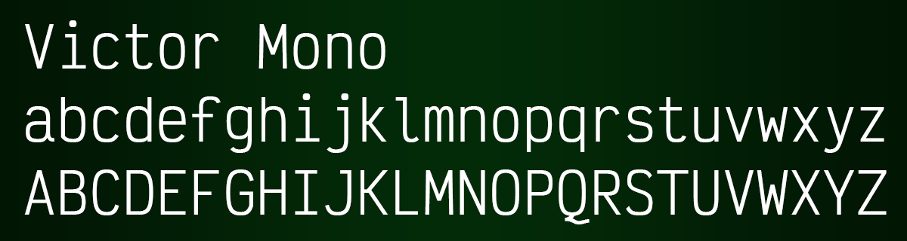

### Roboto Mono
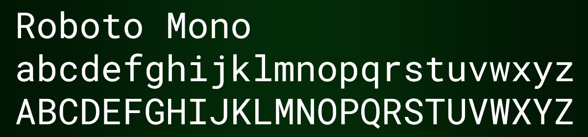

### Menlo
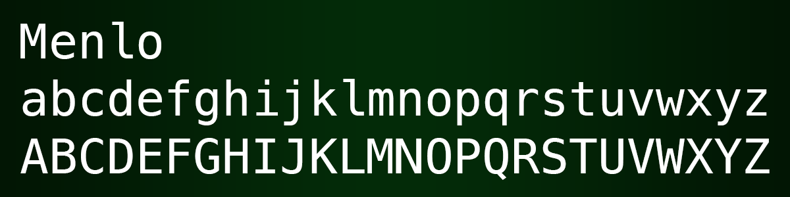

### Dank Mono
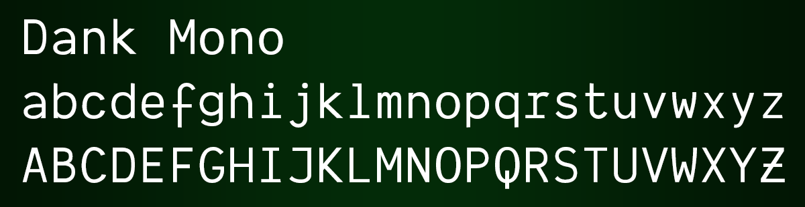

### Cousine
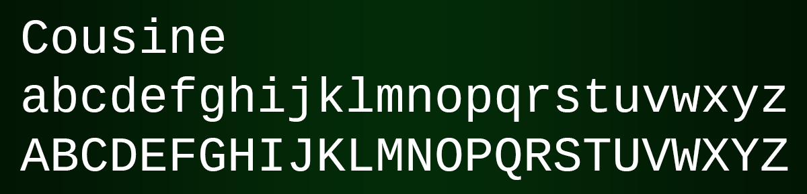

### Anonymous Pro
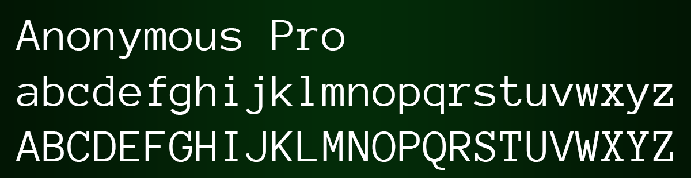

Gradient: `#021604` 50% `#032b08` 50% `#021604`  
Margins: `30px`