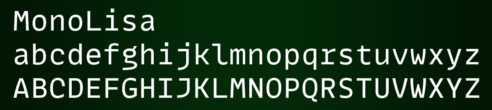

# Monospaced Fonts

### JetBrains Mono

### Operator Mono

### Cascadia Mono

### MonoLisa

### SF Mono

### Fira Code

### Victor Mono

### Roboto Mono

### Menlo

### Dank Mono

### Cousine

### Anonymous Pro

Gradient: `#021604` 50% `#032b08` 50% `#021604`  
Margins: `30px`